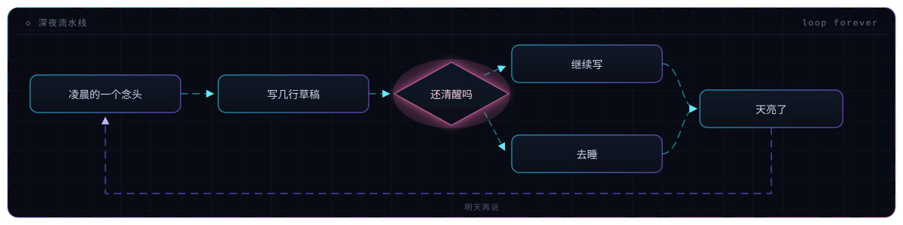
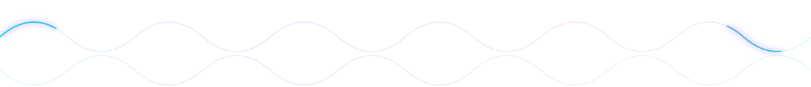

<div align="center">



 



<p>


</p>


</div>

## 深夜频道

开机十一行，全部现画：



## 深夜流水线

从「写一点」绕到「明天再说」，虚线一直在流：



## 面板清单

七张图，都是手写的 SVG。没有模板、没有构建、没有 JavaScript，动画就写在文件里。

| 面板 | 尺寸 | 里面在动什么 |
| --- | --- | --- |
| `hero.svg` | 1200×340 | 三团极光缓慢漂移、流光扫过大标题、色散故障闪、底部三十二根均衡器 |
| `terminal.svg` | 600×340 | 六行命令逐字敲出、构建进度条、转圈、光标闪烁 |
| `orbit.svg` | 600×340 | 三层轨道两枚光点公转、涟漪扩散、心电图来回描线、七十二次心跳 |
| `ticker.svg` | 1200×150 | 条幅无缝滚动、两侧渐隐、底部频谱跳动 |
| `log.svg` | 1200×380 | 十一行日志逐行浮现、扫描线扫过、光标停在最后一行 |
| `flow.svg` | 1200×300 | 虚线箭头持续流动、菱形随心跳呼吸、失败分支从底部绕回起点 |
| `wave.svg` | 1200×130 | 两条正弦波错相位漂移、描边扫光划过 |

## 手绘笔记

三件事必须记住，写下来省得下次再踩一遍。

同一段文字放两份，位移量正好等于一份的宽度，就能无缝循环：

```html
<text x="40" textLength="1040" lengthAdjust="spacing">同一段文字</text>
<text x="1080" textLength="1040" lengthAdjust="spacing">同一段文字</text>
<style>@keyframes marquee{from{transform:translateX(0)}to{transform:translateX(-1040px)}}</style>
```

渐变流光只能交给 SMIL，因为 CSS 动不了 `gradientTransform`：

```html
<linearGradient id="shimmer" x1="0" x2="1" spreadMethod="reflect">
  <animateTransform attributeName="gradientTransform" type="translate"
                    from="-1 0" to="1 0" dur="7s" repeatCount="indefinite"/>
</linearGradient>
```

GitHub 把 SVG 当图片渲染，脚本、外链、外部字体一律不加载，所以全部写死在文件里：

```html

```

## 这块主页

| 项目 | 说明 |
| --- | --- |
| 图形 | 七张手写 SVG，直接打开就能改，改完刷新即生效 |
| 第三方服务 | 只有访问计数徽章一个，没有图表服务，没有追踪脚本 |
| 客户端渲染 | 不用 mermaid，也不用 ansi 代码块，没有「加载失败只剩一坨源码」的失败面 |
| 主题 | 面板自带深色底，浅色与深色主题下观感一致，不做双版本 |
| 交互 | SVG 作为图片渲染，不响应 hover 或点击，所有效果都是自动播放 |
| 字体 | 只用系统字体栈，不加载外部字体 |
| 内容克制 | 不列技能清单，不放联系方式 |

> 夜里写的东西，白天再判断好不好看。

<div align="center">



<sub>手绘 SVG &#183; 无需模板 &#183; 无需任何框架</sub>

</div>
