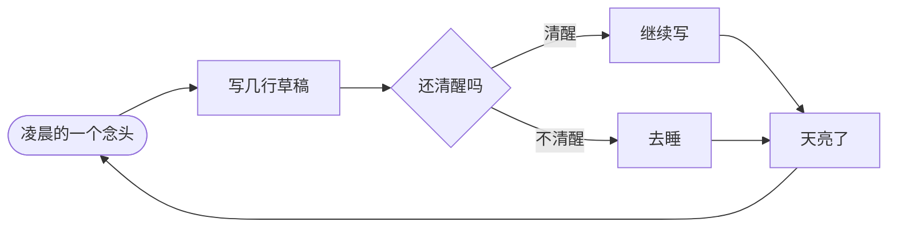

<div align="center">


 


<p>


</p>


</div>

## 深夜频道

开机日志，颜色是 GitHub 原生 `ansi` 渲染的：

```ansi
00:00:01 BOOT  深夜频道已开启，请坐
00:00:02 INFO  把夜晚写成一行一行的光
00:00:03 WARN  咖啡库存不足
00:00:04 TODO  睡觉（长期未完成）
00:00:05 DONE  今天也在认真偷懒
00:00:06 PING  思绪 12ms，波动可忽略
00:00:07 BUILD 五张手写 SVG 编译通过
00:00:08 TEST  颜色、动画、字体自检通过
00:00:09 NOTE  这里不该出现联系方式
00:00:10 TODO  继续写下去
```

## 深夜流水线



## 这块主页

| 项目 | 说明 |
| --- | --- |
| 图形 | 五张手写 SVG，动画全部写在文件里，可以直接打开改 |
| 第三方服务 | 只有访问计数徽章一个，没有图表、动画或追踪服务 |
| 主题 | 面板自带深色底，浅色与深色主题下观感一致，无需双版本 |
| 交互 | SVG 作为图片渲染，无法响应 hover 或点击，所有效果都是自动播放 |
| 字体 | 只用系统字体栈，不加载外部字体 |
| 内容克制 | 不列技能清单，不放联系方式 |

> 夜里写的东西，白天再判断好不好看。

<div align="center">


<sub>手绘 SVG &#183; 无需模板 &#183; 无需任何框架</sub>

</div>